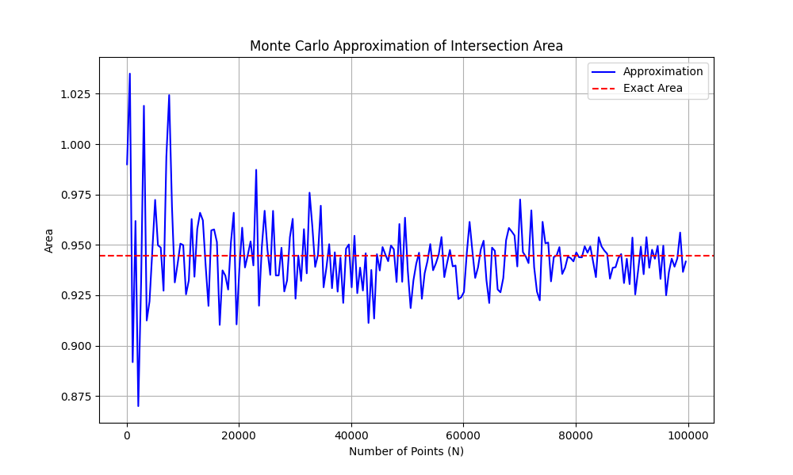
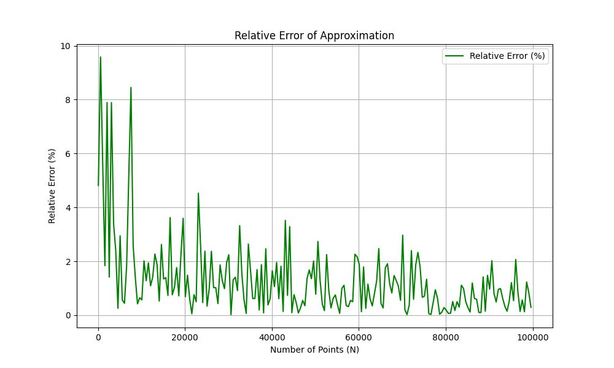

# График, который отображает, как меняется приближенное значение площади в зависимости от указанных параметров алгоритма:

# График, который отображает, как меняется величина относительного отклонения приближенного значения площади от ее точной оценки в зависимости от указанных параметров алгоритма:

# Результаты экспериментов:

При малом числе точек (N ≤ 20000) приближенное значение площади сильно отклоняется от точной площади, отклонение большое.

С ростом числа точек (N ≥ 40000) приближение становится значительно точнее, отклонение уменьшается и стабилизируется.

# Выводы:

Алгоритм Монте-Карло обеспечивает эффективное приближенное вычисление площади пересечения кругов.

Точность сильно зависит от числа сгенерированных точек и размера ограничивающей области.

При увеличении количества сгенерированных точек в среднем точность вычислений улучшается, хоть и существуют некоторые резкие отклонения, этим самым случайные алгоритмы показывают
свой вероятностный характер, где качество результата зависит от случайного распределения точек,
однако при достаточно большом количестве точек эти отклонения становятся незначительными.

  
Бонус

   

